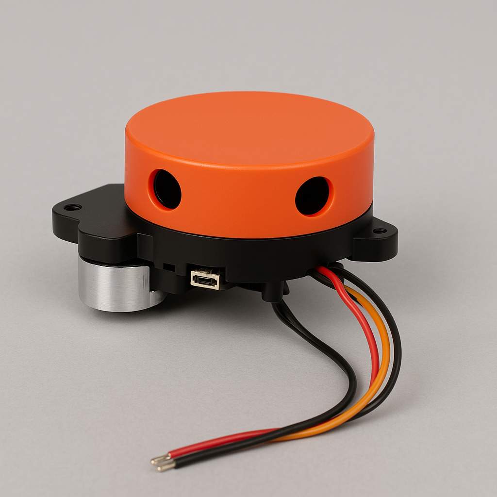
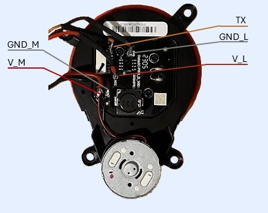
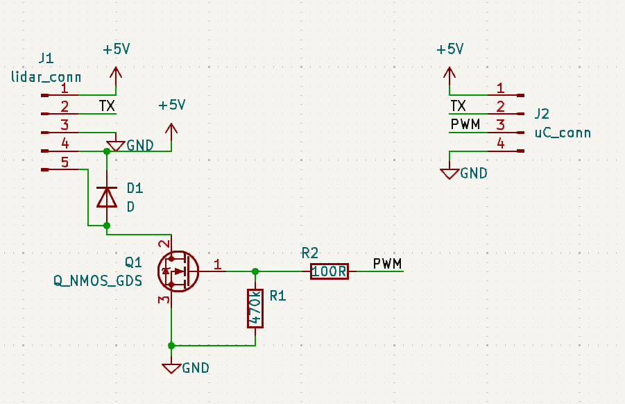

# Delta2C-PRO_D_V001 lidar package



# Hardware
This Lidar has a connector but it is easiest to connect it using the test point on pcb surface.

Here the description of these test point:
| #  | ID   | Description                                                    |
|----|------|----------------------------------------------------------------|
| 01 | V_L  | Logic power supply input. Provide 5V.                          |
| 02 | TX   | UART transmit pin. Connect to the RX pin of your controller.   |
| 03 | GND_L|Ground reference for logic.                                     |
| 04 | V_M  |Motor power supply input. Provide 2.5V or a suitable PWM signal.|
| 05 | GND_M|Ground reference for motor. Isolated from GND_L.                |

In order to interface your uC board to the lidar, you need a small circuit to drive motor and protect your microcontroller to back EMF motor.




ROS 2 package for managing a LiDAR connected via serial. It contains two nodes:
- `serial_reader_node`: read raw data from UART and publish them on `/serial`.
- `packet_decoder_node`: decode packets and publish them on `/scan` and `/rpm`.

## Dependency

- ROS 2 (Humble o successivo)
- `rclcpp`
- `sensor_msgs`
- `std_msgs`
- `serial`

## Structure

```
lidar_serial_bridge/
├── launch/
│   └── lidar.launch.py
├── src/
│   ├── serial_reader_node.cpp
│   └── packet_decoder_node.cpp
├── include/
│   └── lidar_serial_bridge/
│       └── decoder.hpp
├── msg/
│   └── RawPacket.msg
├── CMakeLists.txt
├── package.xml
└── README.md
```

## Topic

| Topic      | Tipo                            | Descrizione                  |
|------------|---------------------------------|------------------------------|
| `/serial`  | `lidar_serial_bridge/RawPacket` | Raw Data from serial         |
| `/scan`    | `sensor_msgs/msg/LaserScan`     | Decoded lidar Data           |

## Execution

```bash
ros2 launch lidar_serial_bridge lidar.launch.py
```

## Parameters

### `serial_reader_node`
- `topic_out` (string): published topic, ex. `/serial`
- `port` (string): serial port, ex. `/dev/ttyUSB0`
- `baudrate` (int): baudrate, ex. `115200`
- 
### `lidar_node`
- `topic_in` (string): subscribed topic. Default:`/serial`
- `topic_out` (string): published topic. Default:`/scan`

## Notes

Ensure user has access to serial port:
```bash
sudo usermod -a -G dialout $USER
```

## License

MIT
